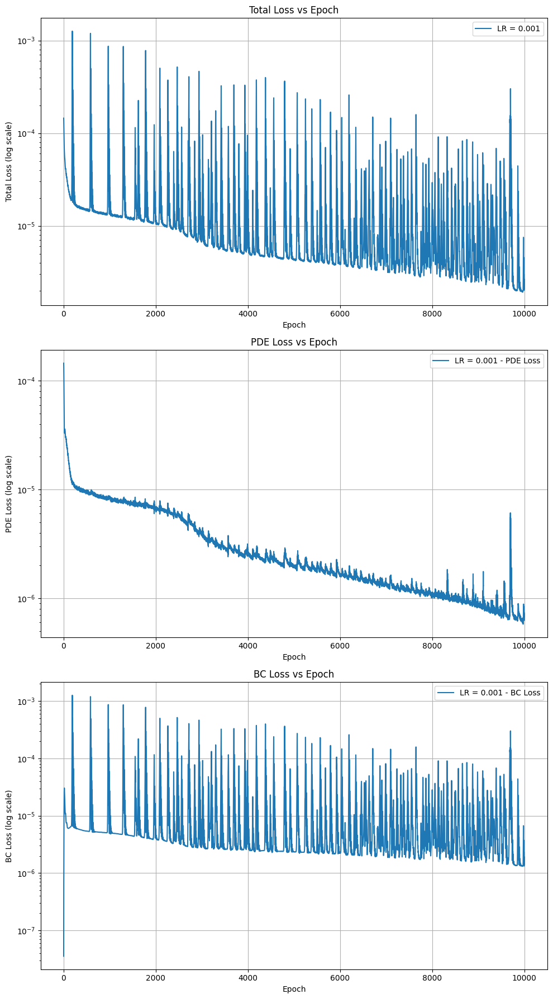

# PiNN for Slope Stability

This project uses a **Physics-Informed Neural Network (PiNN)** to analyze slope stability. It combines physics with neural networks to predict slope deformation and failure.

## Overview

The PiNN models a 2D slope problem using physics equations (linear elastic and gravity). It aims to predict slope stability in a way similar to traditional methods like **Finite Element Method (FEM)**.

## Features
- Predicts slope stability using PiNN.
- Compares PiNN results with FEM.
- Shows displacement and deformation.
- Handles gravity loading.
- Exports displacement data for plotting.


## Model Details

The PiNN is trained using:
- **Physics equations**: 2D linear elastic 
- **Material parameters**:
  - Young's Modulus (E): 50000 kN/m^2   (for example) to compare with FEM from Plaxis2d
  - Poisson's Ratio (ν): 0.3
  - Unit Weight (γ): 18 kN/m³ (for example) to compare with FEM from Plaxis2d
- **Boundary Conditions**: Fixed displacements on the bottom, left, and right sides.
  
  

## Result



## Reference
-  Raissi, M., Perdikaris, P., & Karniadakis, G. E. (2019). Physics-Informed Neural Networks: A Deep Learning Framework for Solving Forward and Inverse Problems Involving Nonlinear Partial Differential Equations. Journal of Computational Physics, 378, 686–707.

## 👨‍💻 Author
-  **Apisit Robjanghvad** : M.eng (Geotechnical engineering student), Department of Civil Engineering **King Mongkut's University of Technology Thonburi (KMUTT)**
Email: [apisit65a@gmail.com] 

## Installation

Install the necessary tools using:

```bash
pip install torch matplotlib numpy
pip install pandas
pip install pytorch
